# Evernote Frontend Service

A frontend for a simple Evernote-style notes app. Works with the backend service: https://github.com/Evyats/Evernote-Backend

## Projects

- `empty-react-tailwind-project`: Empty React + Vite + Tailwind template.
- `react-tailwind`: First version of the app frontend (Tailwind-based).
- `react-material-kit`: Second version, built on top of the Material Kit React (Minimal UI) template from https://github.com/minimal-ui-kit/material-kit-react and implemented using the Codex AI agent.

## Running Locally

### react-tailwind

```
cd react-tailwind
npm install
npm run dev
```

Set the environment variable `VITE_API_BASE_URL` to point at the backend, for example:

```
VITE_API_BASE_URL=http://localhost:8123
```

### react-material-kit

```
cd react-material-kit
npm install
npm run dev
```

Set the environment variable `VITE_API_BASE_URL_1` to point at the backend, for example:

```
VITE_API_BASE_URL_1=http://localhost:8123
```

## Deploying

### react-tailwind

- Set the root folder to `react-tailwind`.
- Configure environment variable `VITE_API_BASE_URL`.

### react-material-kit

- Set the root folder to `react-material-kit`.
- Configure environment variable `VITE_API_BASE_URL_1`.

## Screenshots

### react-tailwind

<table>
  <tr>
    <td><a href="screenshots/react-tailwind/1.png">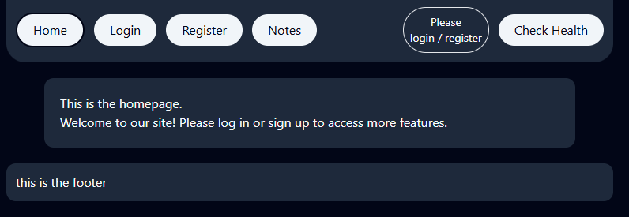</a></td>
    <td><a href="screenshots/react-tailwind/2.png">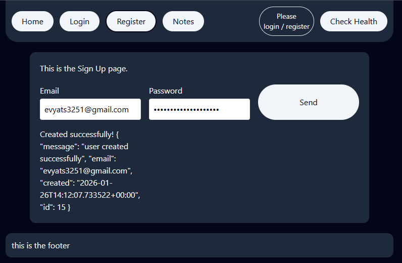</a></td>
    <td><a href="screenshots/react-tailwind/3.png">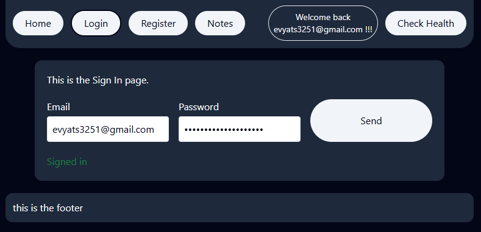</a></td>
  </tr>
  <tr>
    <td><a href="screenshots/react-tailwind/4.png">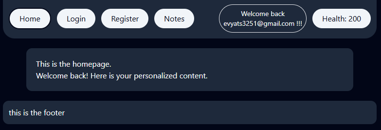</a></td>
    <td><a href="screenshots/react-tailwind/5.png">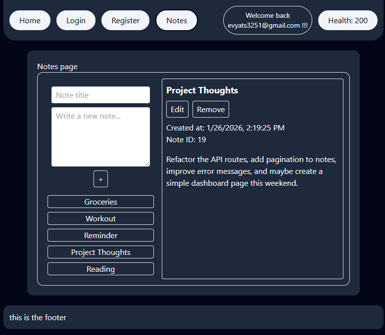</a></td>
    <td><a href="screenshots/react-tailwind/6.png">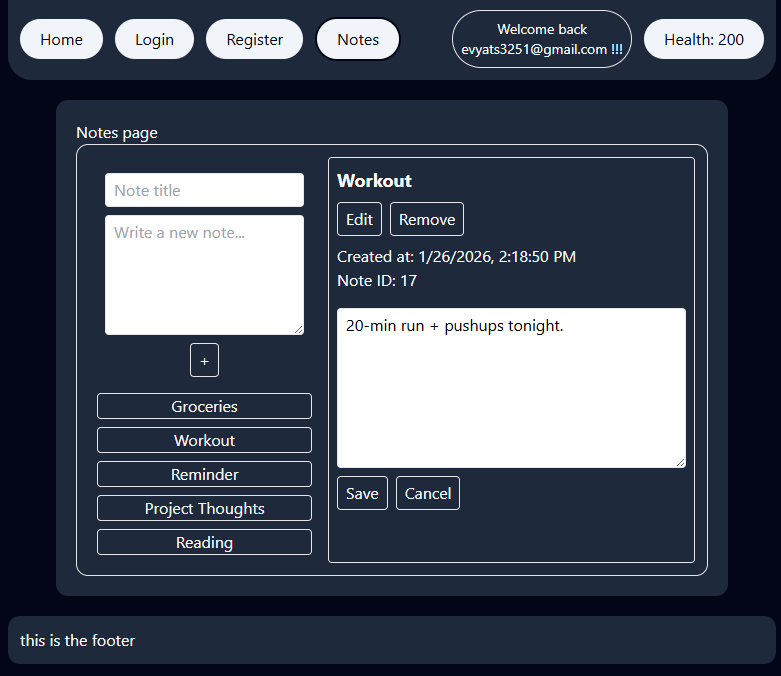</a></td>
  </tr>
</table>

### react-material-kit

<table>
  <tr>
    <td><a href="screenshots/react-material-kit/1.png">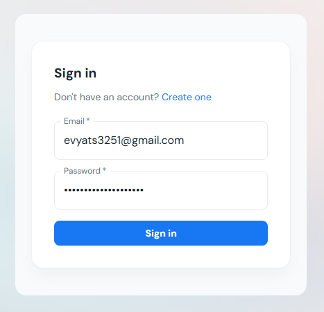</a></td>
    <td><a href="screenshots/react-material-kit/2.png">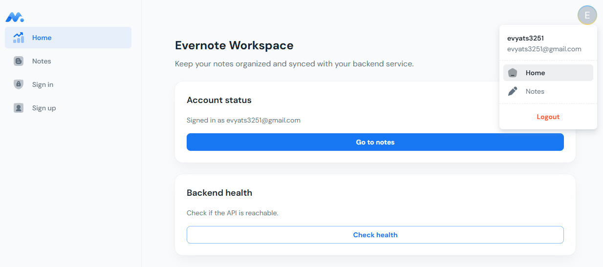</a></td>
    <td><a href="screenshots/react-material-kit/3.png">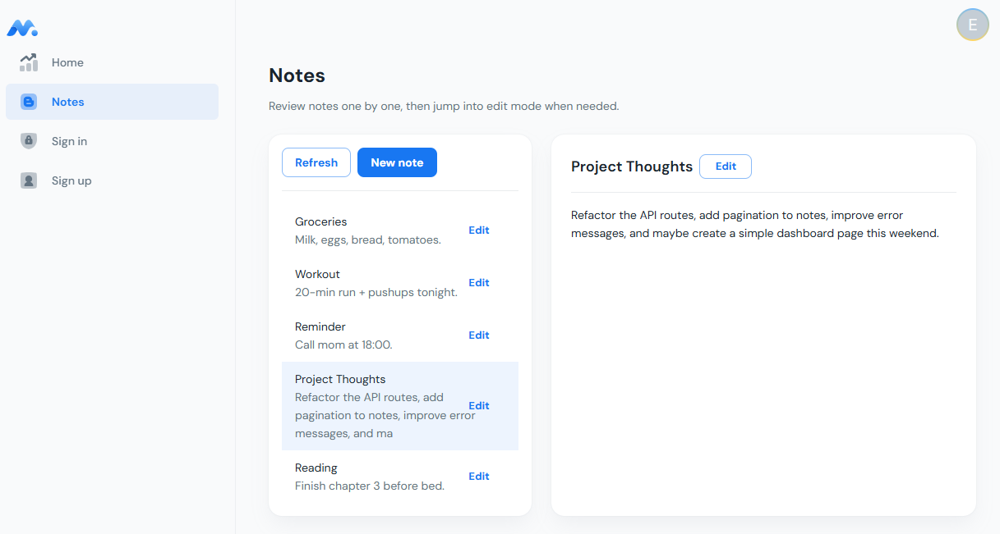</a></td>
  </tr>
  <tr>
    <td><a href="screenshots/react-material-kit/4.png">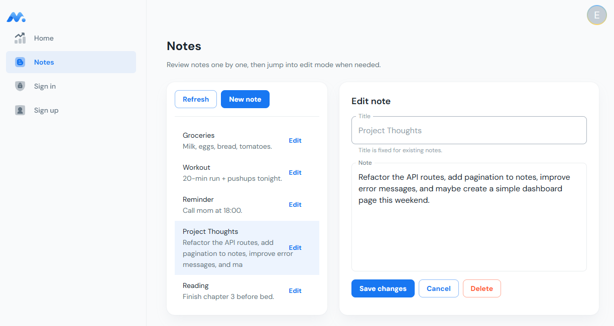</a></td>
    <td><a href="screenshots/react-material-kit/5.png">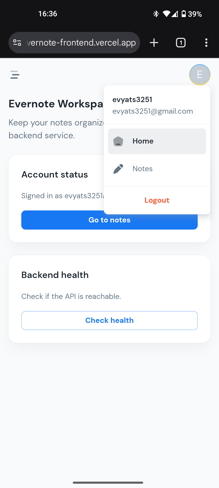</a></td>
    <td><a href="screenshots/react-material-kit/6.png">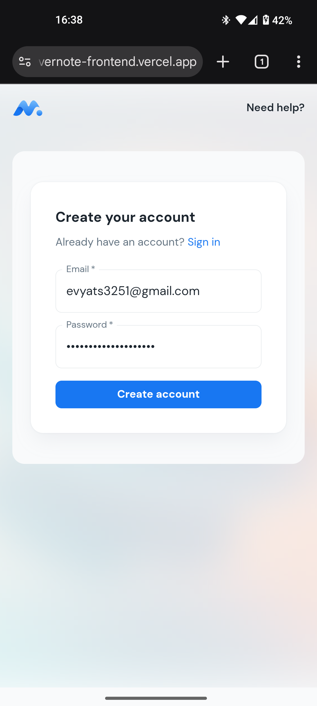</a></td>
  </tr>
  <tr>
    <td><a href="screenshots/react-material-kit/7.png">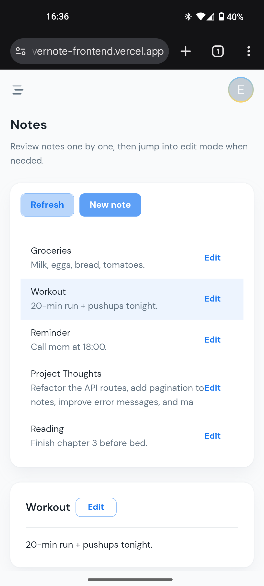</a></td>
    <td><a href="screenshots/react-material-kit/8.png">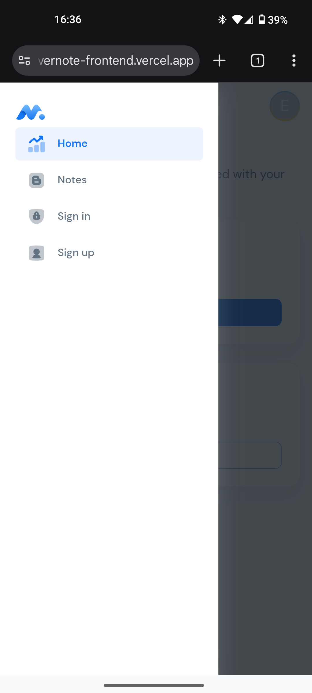</a></td>
    <td></td>
  </tr>
</table>
